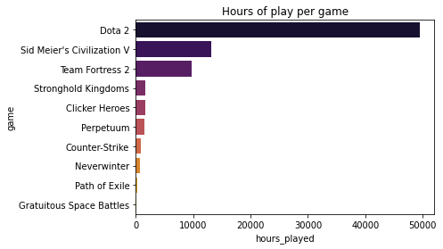
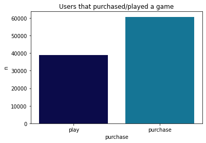

# Steam recommendation system

Steam is the largest video game hosting platform in the market with a large caleloge full of games. With access to such a variety of games, sometimes users may feel overwelmed, or feel unsure with where to start, there for it is absolutely vital that both customers new and old are provided with recommendended suitable games that align with their specific preferences. 

Therefore for this project i decided to create a recommendation system for steam games to help users find suitable game recommendations that they would be interested in. My goal for this project is to provide more accurate predictions regarding providing a user with accurate recommendations, through using a combination of steam's api, steamspy's api and kaggle data sets as well.

Links:
* [isabel.susan.joseph@gmail.com]()

### Executive Summary

For this project the aim is to improve steam's current recommendation system to provide users with much more accurate recommendations.

To solve this problem, i will be creating a content and collaborative based recommendation model that provides video game recommendations to steam users. This project will utlize Steam's API, SteamSpy's API along with data sets sourced from kaggle in order to create a recommendation system.

I took data for this project from Steam's api, Steamspy and two kaggle data sets.
* [https://www.kaggle.com/tamber/steam-video-games]()
* [https://www.kaggle.com/nikdavis/steam-store-games]()
* [https://steamcommunity.com/dev]()
* [https://steamspy.com/]()

Following that i ran multiple models for each of the collaborative and content based models. With my collaborative model i used a memory based model that used KNNBasic, KNNBaseline and as well as KNNWithMeans. In addition to that i also used SVD for my model based collaborative filtering model. According to the results obtained, after comparing all the RMSE and MAE scores among all the models, it was found out that the KNNBaseline with pearson similarity (USER BASED) model had preformed the best out of all of the other models ran. 

With my content based model i utlized TFIDF, helps identify which item is similar to each other, and  recommend a user similar items that the user has previously liked.
 

### More Information

data_cleaning.ipynb
* Business understanding
* Data preparation: obtaining data from Steam’s API, SteamSpy’s API and as well as obtaining the two data sets sourced from Kaggle. At this stage I also merged all of the data frames together to form one data frame containing all the necessary information needed for creating a recommender system.
* Data cleaning: removing duplicate ids, dealing with null values and also transforming some of the data to make it more usable. 

content_based.ipynb
* Data understanding: exploratory data analysis 
* Modeling (content based model): creating a content based model using TFIDF
* Evaluation (content based model)

collaborative_based.ipynb
* Modeling (collaborative based model): i used a memory based model that uses KNNBasic, KNNBaseline and KNNWithMeans. As well as using SVD for my model based collaborative filtering model.
* Evaluation (collaborative based model)
* Deployment: future work and recommendations.

### Data Visualizations

